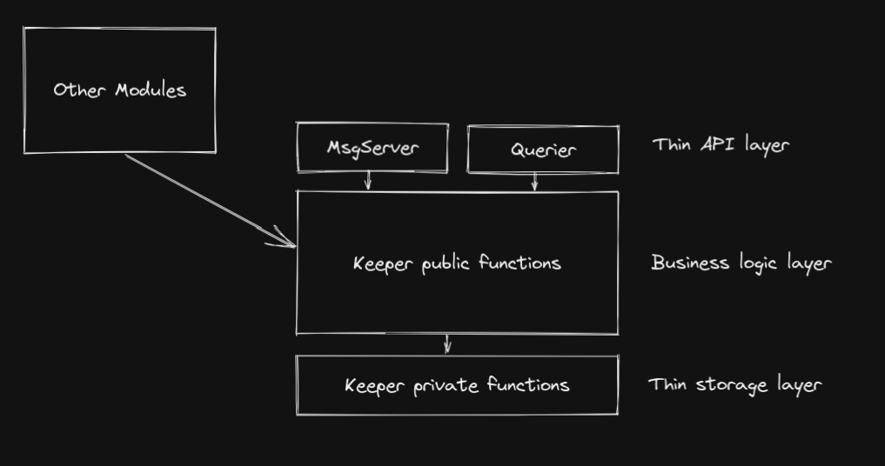

# Coding Guidelines

## Module structure

We try to follow the folder structure outline in the Cosmos SDK docs: https://docs.cosmos.network/main/building-modules/structure

For documentation of a module, we use the `README.md` file under `x/modulename`. The format should conform to the docs outlined in the Cosmos SDK docs: https://docs.cosmos.network/main/spec/SPEC_MODULE

## Keeper structure

To keep a clean separation of concerns in our modules, we construct our keeper this way:
- API Layer: MsgServer and Querier
- Business logic layer: Public Keeper methods
- Storage layer: Private Keeper methods



### API Layer: MsgServer and Querier

A thin layer that mainly deals with converting messages to whatever the Keeper methods requires, 
as well as converting responses to message response formats for queries.

### Business logic layer: Public Keeper methods

This is the layer where all the magic happens. Think of this as the main entry point to _doing things_. 
The API layer will call in here directly, as will any "external" modules. 

The business logic layer should not make any assumptions about how it was called, so it needs to make sure the data it asks for is correct.

The business logic layer should not panic unless something is terribly wrong with the state, instead it should send back sensible errors.

The methods exposed here should in most cases not be just "setters" and "getters". It should be business operations that give value.
Setter and getters are for the storage layer.

### Storage layer: Private Keeper methods

This is the layer where storage is updated. Setters and getters might make sense here. 
The functions should be private and can make assumptions about correctness of data it is being sent.

## Proto files

### Pointers

The general rule should be to not use pointers. Pointers are ugly, slow (for small data collections) and most of the time unnecessary.
Use ` [(gogoproto.nullable) = false];` whenever possible.

Example:
```protobuf
message QueryResponse {
  MyEntity entity = 1  [(gogoproto.nullable) = false];
}

message AnotherQueryResponse {
  repeated AnotherEntity entities = 1 [(gogoproto.nullable) = false];
}

message MsgWithNestedTypes {
  uint64 something = 1;
  NestedType nestedType = 2 [(gogoproto.nullable) = false];
}
```

## Errors

To keep testing and debugging as easy as possible, we try to create good errors rather than use generic ones.
This does not mean we need a unique error for every single error scenario.
A good rule of thumb is: "if all I had was the error code, would I be able to find some useful information about what happened?".

Error codes are grouped by the different types of entities. The grouping is done with the first digit(s), corresponding to the digit in the storage key.
Given a key like this in `keys.go`
```go "test"
var MyEntity = []byte{0x02}
```
The errors could look like in `errors.go`:
```go
var ErrAboutMyEntity = errors.Register(ModuleName, 2001, "my first error")
```

The error number count from 1 by default, but if the error has a close correspondence in http error codes, use that instead.
For example, for the error code `2404` would indicate that `MyEntity` is not found.
```go
var (
    ErrAboutMyEntity = errors.Register(ModuleName, 2001, "my first error")
    ErrNotFoundMyEntity = errors.Register(ModuleName, 2404, "my entity was not found")
)
```

## Testing

We are using the Test Pyramid approach to cover new code with tests. Everything should be tested on the lowest possible level.
Duplicating exactly the same tests in different test types is discuraged. Below are types of tests used listed from the lowest
to highest level of test pyramid. Simulation and smoke tests are not a part of test pyramid as they do not provide code coverage in a standard way, but are also encouraged.
### Unit Tests

Should be used to handle message and various objects validation testing, so we don't have to care about empty or invalid messages in more complex tests. Genesis tests are also a part of this category. Most of the unit tests are in:
- `types_test.go`
- `msgs_test.go`
- `genesis_test.go`

### Integration Tests

Second level of the Test Pyramid. Should be used to test messages, queries and various interactions between modules and states. Tests are usually placed in:
- `msg_server_test.go`
- `query_server_test.go`

### End to End Tests

Highest level of the Test Pyramid. Spins up a local instance of the chain that can be interacted with using cli commands. Should be used whenever test scenario is complex enough that it cannot be properly implemented on the integration test level, for example, when it concerns IBC.

E2E Tests are placed in a separate package `tests/e2e`.

### Simulation Tests

Simulation tests are an automated way to create pseudorandom blockchain states and verify the integrity of the data. It is encouraged to cover keeper messages with simulation tests.

### Smoke Tests

Similar to E2E tests, but automated using Bash instead of Go Test Suite, smoke tests spin up a local blockchain node and run test scenarios using blockchain's cli. It is encouraged to cover every new cli command with a smoke test.

## Coding tips

### Where to look for typical ways of doing this

If you are not sure what a good way of doing something in particular, there are a few places that could be good starting points:
1. The [Cosmos SDK Docs](https://docs.cosmos.network) sometimes have recommendations on how to do things, we try to follow those
2. Look at code. Try to find a module that does something similar to what you want to do and see if it makes sense.
    - [Cosmos SDK code](https://github.com/cosmos/cosmos-sdk) is often good (Group module, NFT, Bank are all pretty solid)
    - [Osmosis](https://github.com/osmosis-labs/osmosis)
    - [Regen](https://github.com/regen-network/regen-ledger/)
    - [Cheqd](https://github.com/cheqd/cheqd-node)
    - [Stargaze](https://github.com/public-awesome/), but mostly CosmWasm or non-module-based things

### Typical order of making changes (especially new things)

1. Make changes in the proto files
    - Update any changes in spec
2. Generate proto `$ make proto`
3. Implement/Update `Validate()` on any non-rpc messages (i.e. data structures to be persisted in the keeper and in genesis)
4. If you created any new rpc messages:
    - Implement the `sdk.Msg` interface in `msgs.go` (`_ sdk.Msg = &MsgName{}`)
    - Update `WeightedOperations` in simulation/operations.go with the new operation
    - Don't forget to create tests for `ValidateBasic`!
5. Implement `MsgServer`/`Querier` and `Keeper` methods
    - Don't forget events
    - Don't forget integration tests
    - If you create public Keeper methods, they need to be tested as well
6. If you created a new type to be stored (i.e. you added a new store key in keys.go)
    - Update `NewDecodeStore` in simulation/decoder.go
7. Update genesis if necessary (in genesis and keeper/genesis)
    - Update `RandomizedGenState` in simulation/genesis.go if necessary 
8. Update the client/cli if necessary
9. Create e2e tests in `tests/e2e`
10. Format and lint your code before committing: `$ make format` and `$ make lint`

## Native modules vs smart contracts
Short version: core stable functionality/protocol implemented as native Cosmos SDK modules, extra functionality/nice-to-have stuff that can change often as smart contracts.

EmpowerChain has the capability to have both native Cosmos SDK modules and smart contracts in the form of CosmWasm contracts.

We use both and the guiding principles for when to use them are as follows:
- Core functionality or "protocol level stuff" should always be implemented as native SDK modules
- Things that are very stable and doesn't need to change often could be considered for a native module
- Things that will likely need to change very often could also be good candidates for smart contracts (since it is easier to upgrade a smart contract than the protocol)
- Non-core functionality that just extends the capabilities of the core (but that we would be perfectly fine with anyone else implementing anywhere else if it supported our use cases) can go into smart contracts
- Nice-to-have and utilities can go into smart contracts
