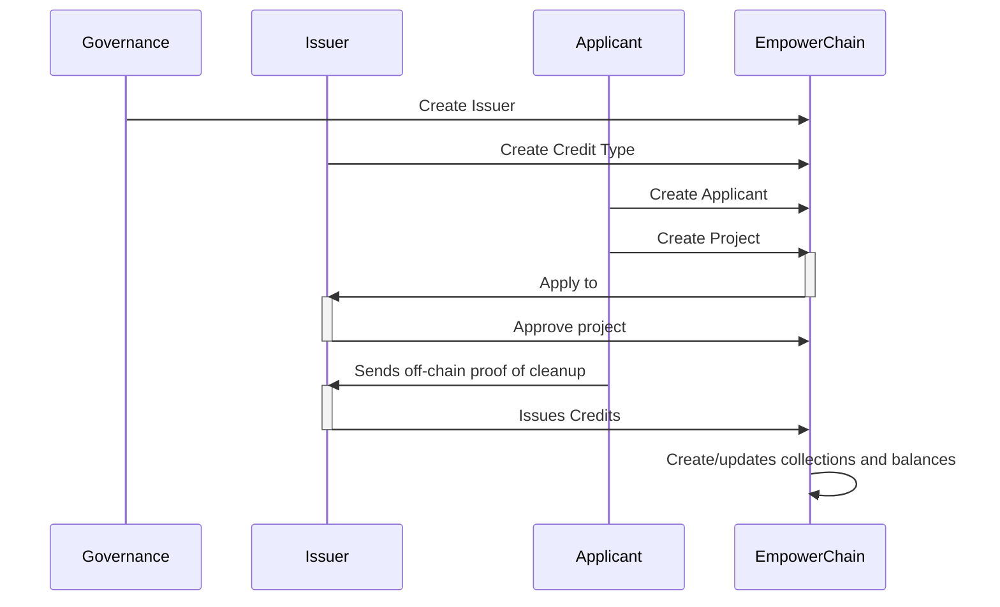
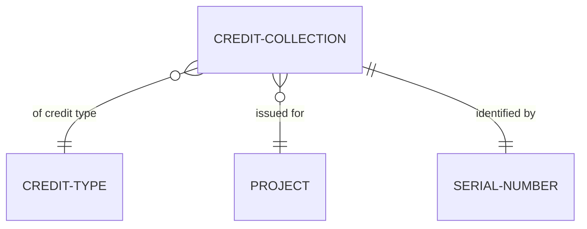
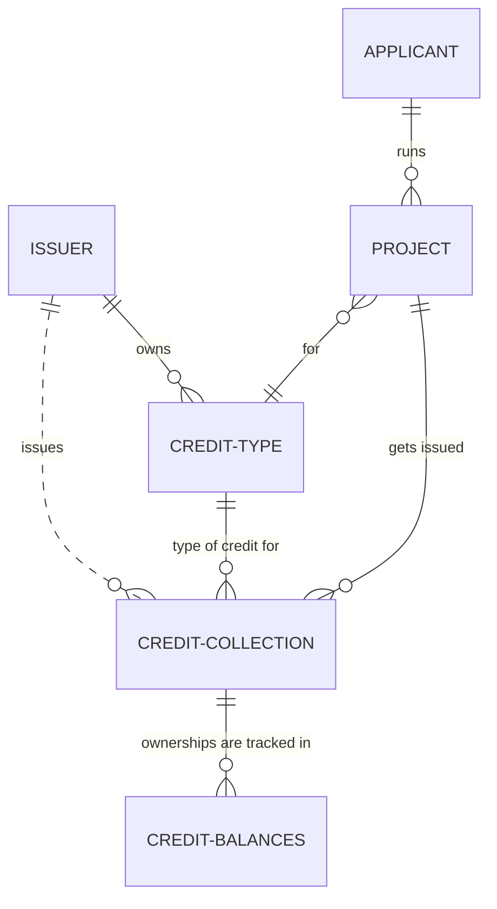

# Plastic Credit

The `plasticcredit` module keeps track of plastic credits issued, traded/transferred and retired on-chain.

## Abstract

Plastic credits are a type of market-based environmental policy that is designed to reduce plastic pollution.
They can represent offsets created by removing plastic from the environment or other initiatives to support the reduction of plastic waste in nature.

The idea behind plastic credits is to create financial incentives for businesses to reduce their use of plastic and to develop more sustainable alternatives.

Using blockchain technology, an on-chain plastic credit system can provide a more secure and efficient way to track and manage plastic credit transactions.
It allows for real-time tracking of plastic credit balances, and it makes it possible to accurately and transparently verify that plastic credit transactions are in compliance with the established limits on plastic use.

On-chain plastic credits also have the potential to enable the development of new financial instruments, such as plastic credit-backed securities or derivative products, which could help to further drive the market for plastic credits and encourage the reduction of plastic pollution.

The `x/plasticcredit` module is an implementation of the major underlying concepts of on-chain plastic credits.
It allows issuers of plastic credits to control the issuance of plastic credits.
And it enables permissionless accounting by the protocol, similar to that of a centralized registry (just better and more transparent).
In other words, it keeps track of plastic credits issued, traded/transferred and retired on-chain.

Below is a high-level sequence diagram of how the credit issuance flow works:

## Concepts

### Plastic Credits

A plastic credit is a digital unit that represents an offset created by removing plastic from the environment.

A single plastic credit is typically defined as some unit of weight of plastic that has been removed or diverted from nature (although there are other types as well, such as plastic recycling credits).
The unit can be for in kg's, metric tons or any other unit the issuer chooses.

Usually you will also see that plastic credits are standardized, or at the very least well document, in a way that makes one credit different from another.

Credits are neither fully fungible, nor entirely non-fungible. 
Credits are uniquely issued for a specific credit type, a specific project and finally for a specific "serial number". 
More on this under the section about credit collections.

The entity relationship diagram below shows the different parts that a single credit collection is made up of. 
All credits within a single credit collection are fungible with each other, but no credits are fungible between credit collections.

### Issuers

A plastic credit issuer is an organization that is responsible for the credits they issue.

TODO: Write more about what issuers do and who they are

### Applicants/Credit receivers

TODO: Write about applicants, collectors, recyclers, etc

### Projects

TODO: Write about projects

### Credit Collections

TODO: Write about credit collections

### Credit Balances

TODO: Write about credit balances

## State

Below is an Entity Relationship diagram of the on-chain entities

### Params

The plasticcredit module stores it's params in state with the prefix of 0x00, it can be updated with governance or the address with authority.

Params have the `issuer_creator` which is a field that controls who is allowed to create new issuers.
If the issuer_creator is empty (it is by default), the controlling entity is the gov module.

- Params: `0x00 | ProtocolBuffer(Params)`

### ID Counters

ID Counters is a global object to keep track of ID indexes. It keeps at all times the next id for the entities that need it:
`next_issuer_id`, `next_collector_id` and `next_project_id`.

- ID Counters: `0x01 | ProtocolBuffer(IDCounters)`

### Issuer

An Issuer is an entity that is allowed to create credit types and issue Credits under their own Types.
They are the entity responsible for the data, quality and trust of the plastic credits they issue.

An issuer consists of the following fields: `id`, `name`, `description`, `admin`, with `id` being the unique identifier for an issuer.

`name` and `description` is mainly for identifying and letting clients get information on issuers.

`admin` is the address of the administrative account that controls the issuer and can update information.

Only the `issuer_creator` from `Params` is allowed to create new issuers.
This is typically either directly through governance or through a sub-dao or group.

- Issuer: `0x02 | issuerID | -> ProtocolBuffer(Issuer)`

### Applicant

An Applicant is an entity that can apply for - and get issued by an issuer - plastic credits.

An Applicant consists of the following fields: `id`, `name`, `description`, `admin`, with `id` being the unique identifier for an applicant.

`name` and `description` is mainly for identifying and letting  clients get information on applicants.

`admin` is the address of the administrative account that controls the applicant and can update information.

- Applicant: `0x03 | applicantID | -> ProtocolBuffer(Applicant)`

### Credit Type

A Credit Type is the description of a type of plastic credit. It is created and owned by a single issuer.

A Credit Type consists of the following fields: `id`, `issuer_id`, `name`, `denom`, with `id` being the unique identifier for a Credit Type.

The `issuer_id` field is the direct link to the Issuer that has created and operates this Credit Type.

`name` is mainly a human-readable name for a credit type such as "Empower Plastic Credits".

`denom` is the short unique denominator for the plastic credits in this credit type (e.g. "PTEST")

- Credit Type: `0x04 | creditTypeID | -> ProtocolBuffer(CreditType)`

### Project

A Project is the context within credits gets issued. A project is created by an applicant and needs to be approved by an issuer.

A project consists of the following fields: `id`, `applicant_id`, `credit_type_abbreviation`, `name` and `status`, with `id` being the unique identifier for an application.

The `applicant_id` field is the direct link to the Applicant that owns the project and will get any issued credits.

`credit_type_abbreviation` is a direct link to the CreditType which is the type of credits that the project can get issued.

`name` is the name of the project.

`status` is the status of the project in relation to the credit type. Only someone with authorization on the credit type can change this.
The project can in one of the following states: new, approved or rejected

- Project: `0x05 | projectID | -> ProtocolBuffer(Project)`

### Credit Collection

Credit Collection contains references to formal information about the collection and overall amount of minted and retired credits.
- `denom` - denomination of the collection, which is unique per collection and consists of `Credit Type` denom and a chosen suffix, e.g. `ETEST/123`. Denom is also used as a store key.
- `Active amount` - amount of credits that are active for a given collection (weren't retired).
- `Retired amount` - amount of credits that have been retired for a given collection.
- `Credit data` - URLs and proofs to all the data relevant to a given Credit Collection.

- CreditCollection: `0x06 | denom | -> ProtocolBuffer(CreditColletion)`

### Credit Balance

Credit Balance stores a balance of credits of a given denom and for a given owner address. Store uses compound key, which is constructed from owner address and credit denom. The value of Credit Balance contains the amount of active and retired credits of a given denom and for a given owner address.

- CreditBalance: `0x07 | owner address | denom | -> ProtocolBuffer(CreditBalance)`