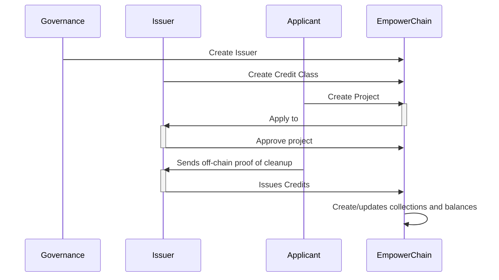
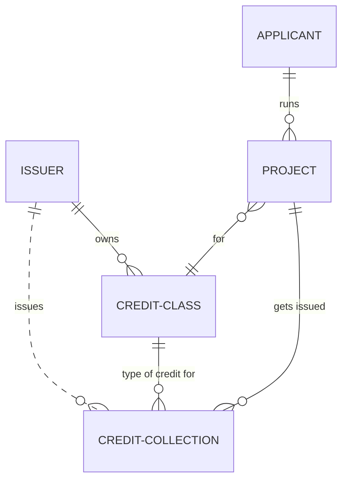

# Concepts

## Credit

Credit is a digital unit that represents an offset created by removing plastic from the environment. Every Credit is based on a `Credit Class`, which describes the requirements that have to be met to obtain the Credits.

// TODO

Below is a high-level sequence diagram of how the credit flow works:

Below is an Entity Relationship diagram of the on-chain entities

