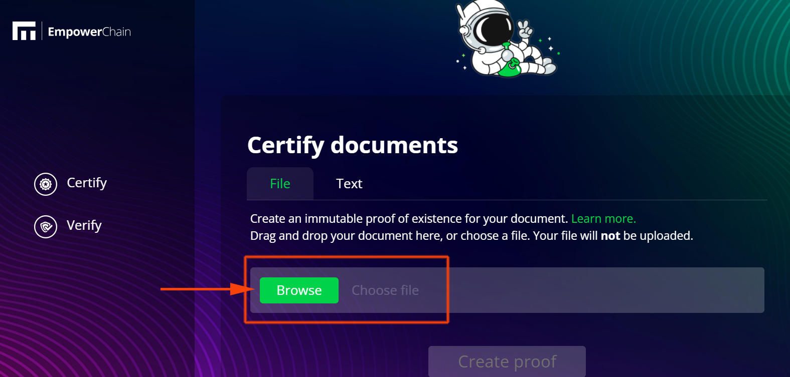
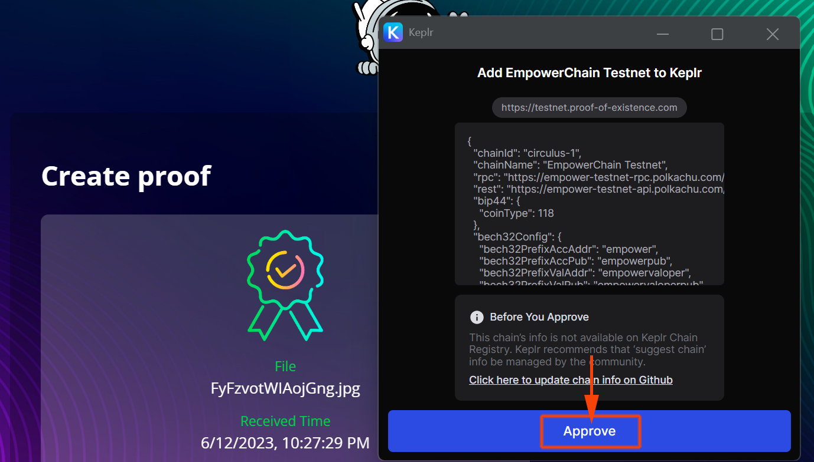
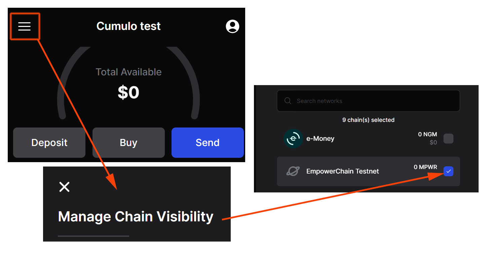
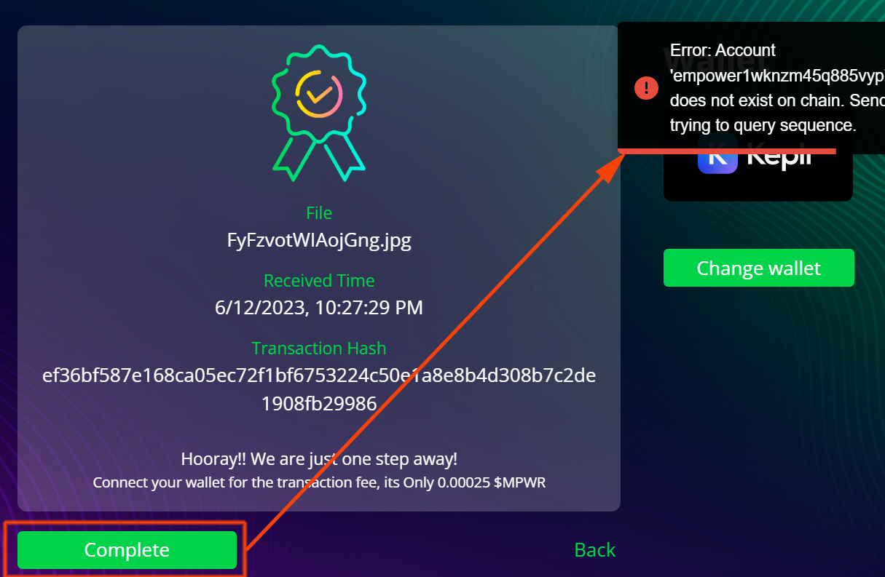
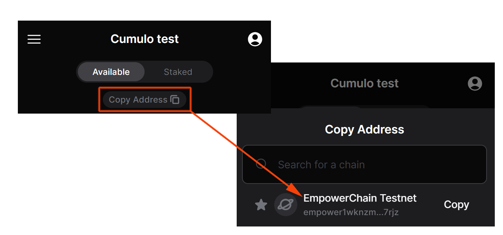
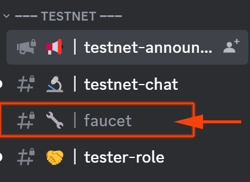
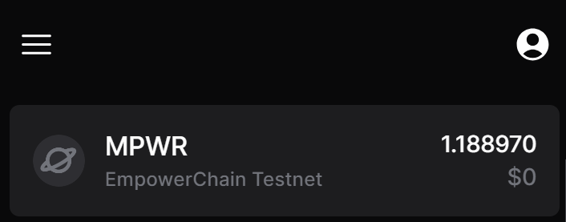
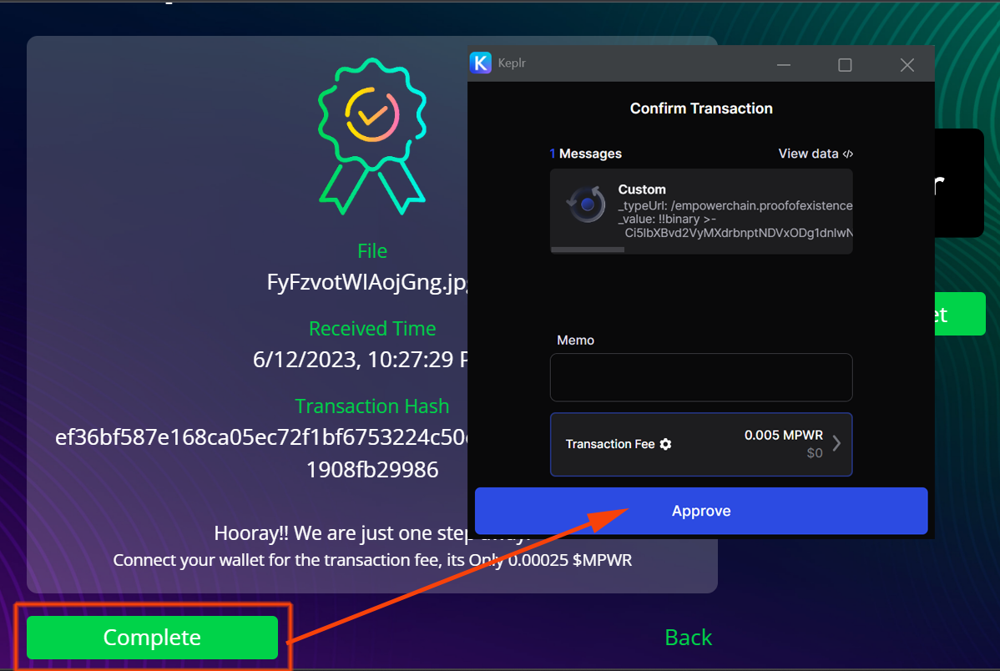
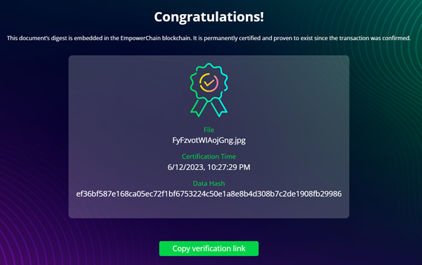
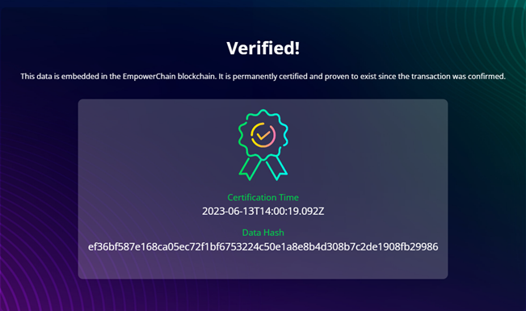

## Introduction
Proof of existence is a blockchain-based protocol that proves that a digital document exists at a given point in time. This mechanism behaves digitally like a notary that creates a record of the existence of a document without the need for a third party and in a decentralised manner. The identity of the document is stored on the chain using a hash algorithm with a timestamp of the transaction, providing an irrefutable time-stamped record of the existence of the data. The applications of this protocol are manifold, from notarisation, to protecting intellectual property rights, certifying documents, etc.

### What I need?
Any type of digital document that you wish to certify as proof of existence.

## Create proof of existence 
Go to the Dapp:
[https://testnet.proof-of-existence.com/](https://testnet.proof-of-existence.com/)

Choose **Certify** option and click on the **Browse** button:

Select the file to which you want to assign the existence proof and click on the **Create proof** button:

If you have Keprl installed, the contract to add the EmpowerChain network to Keprl will appear.

**NOTE**: if you do not have Keprl installed you can use our [Keprl wallet quick installation guide](https://medium.com/cumulo-pro/keprl-wallet-quick-installation-guide-8d443caf4336)

Once you have added the Empowerchain network you must show it in Keprl, to do this click on the main menu, go to **Manage Chain Visibility** and activate **EmpowerChain Testnet** to show the network in the wallet:

If you now try to complete the proof of existence process, it will return an error as we have no funds in the wallet:

To apply for the faucet and get funds to pay the fees you need to copy the address, at the top Copy Address, choose EmpowerChain Testnet:

Go to Empower Discord:
 [https://discord.com/invite/DNB4z8EZDx]( https://discord.com/invite/DNB4z8EZDx)

On the #Faucet channel request your tokens:

Check your Keprl balance:

You can now return to the Dapp to finish the proof of existence process, click on Complete and confirm the transaction by clicking on **Approve**:

Congratulations, you have finished your proof of existence process, you can now copy the verification link that will serve as proof of the registered document:

Copy the verification link:
[https://testnet.proof-of-existence.com/verify/success?hash=ef36bf587e168ca05ec72f1bf6753224c50e1a8e8b4d308b7c2de1908fb29986](https://testnet.proof-of-existence.com/verify/success?hash=ef36bf587e168ca05ec72f1bf6753224c50e1a8e8b4d308b7c2de1908fb29986)

At any time you can witness the processed document with the link:

