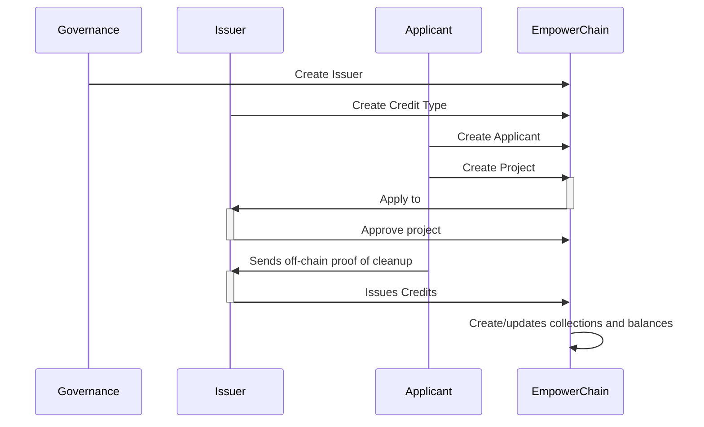

# Plastic Credits: High level overview

Plastic credits are a type of market-based environmental policy that is designed to reduce plastic pollution.
They can represent offsets created by removing plastic from the environment or other initiatives to support the reduction of plastic waste in nature.

The idea behind plastic credits is to create financial incentives for businesses to reduce their use of plastic and to develop more sustainable alternatives.

Using blockchain technology, an on-chain plastic credit system can provide a more secure and efficient way to track and manage plastic credit transactions.
It allows for real-time tracking of plastic credit balances, and it makes it possible to accurately and transparently verify that plastic credit transactions are in compliance with the established limits on plastic use.

On-chain plastic credits also have the potential to enable the development of new financial instruments, such as plastic credit-backed securities or derivative products, which could help to further drive the market for plastic credits and encourage the reduction of plastic pollution.

## How it works
On a very high level, the plastic credit system works as follows:
1. An issuer creates a plastic credit type
2. An applicant applies to the issuer with a specific project
3. The issuer approves the project
4. The applicant sends off-chain proof of cleanup to the issuer
5. The issuer issues plastic credits to the applicant
6. The applicant can trade the plastic credits on the market

## Plastic Credit types
A plastic credit type is a type of plastic credit that is issued by a specific issuer. 
It represents a specific standard or methodology for collection, cleanup or recycling of plastic waste.
This means that there can be multiple types of plastic credits on the market, each representing different actions (and verifications) having taken place.

Applicants apply to an issuer and a credit type with a specific project. The issuer can then approve the project and later issue plastic credits to the applicant.

## Issuers
An issuer is an entity that owns and creates plastic credit types, as well as issues plastic credits to applicants.
They are the sole authority on what plastic credit types are valid and what projects are approved.

New issuers can only be created through governance, or by a dedicated authority (such as a group appointed by governance) 

## Applicants
An applicant is an entity that applies to an issuer with a specific project. They can be individuals, companies, NGOs, etc.

Applicants also typically applies to the issuer to get plastic credits issued with different proofs and data about the activities for which they want to get plastic credits issued.

## Projects
A project represents the activities that an applicant wants to get plastic credits issued for. A project can be time-bound or ongoing.

A single project can only apply and be approved for a specific plastic credit type. 

The issuer can issue multiple batches of plastic credits to an applicant for the same project, as long as the project is ongoing.

## Plastic Credit Collections
A plastic credit collection is a collection of plastic credits that are issued by a specific issuer, that are of the same type and that are issued for the same project. 

Depending on the plastic credit type, a plastic credit collection can be time-bound or ongoing. Meaning that for instance an issuer can issue credits in a new collection every month so that the credits are time-bound.

A plastic credit collection is unique per credit type, project and serial number. 
It is up to the issuer and the standard of the credit type to decide what constitutes a new serial number.
It could for instance be a time-bound serial number (e.g. a new serial number every month), 
a serial number that is incremented for every x credits issued, or something else entirely.

## Plastic Credits
A plastic credit is a digital unit that represents an activity related to removing plastic from the environment. A single credit can represent a kg or ton of plastic removed/recycled/handled, or some other unit of measurement.

Plastic credits are neither fully fungible, nor entirely non-fungible. A credit is fungible only within a single credit collection, but not between credit collections.
Each credit collection (which is unique per credit type, project and serial number) is a batch of credits that are fungible within that batch, but not between batches.
Another way to think of each collection is as it having its own type of token (ERC20 or similar) that can only be traded within that collection.

## Read more
You can find more in-depth technical details on the implementation of the plastic credits in the [plastic credits module docs](../../references/module-docs/plasticcredit.md)