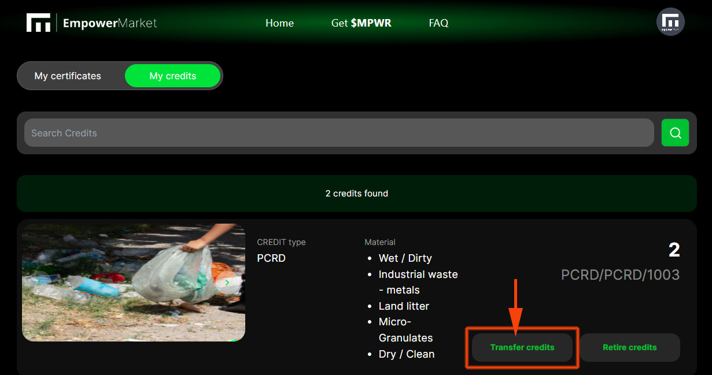

# EmpowerMarket User Guide

## Intro
Plastic credits are generated through the efforts of local plastic collectors who clean up specific areas and register the plastic with Empower. Once the plastic credits are created, the collectors can offer them for sale on the Empower portal. Empower reviews the documentation provided to approve the credits, which are allocated to the buyers. The buyer receives a certificate and completed documentation at the time of purchase.

[+info on Empower]( https://docs.empowerchain.io/core-modules/plastic-credits/high-level-overview)

Or you can read our latest medium on Driving Sustainable Impact with Tangible Results:
[Empower Plastic Credits:](https://medium.com/@cumulo.pro/empower-plastic-credits-53d43aff2386)

## How to use Plastic Credit Marketplace web app

[https://testnet.empower.market/](https://testnet.empower.market/)

**Connect wallet**

To be able to perform operations such as buying plastic credits you must have your Keprl wallet connected, to do this click on the top right button:

In the Keprl window **Approve** the connection to the EmpowerMarket Dapp:

NOTE: if you do not have Keprl installed you can use our [Keprl wallet quick installation guide](https://medium.com/cumulo-pro/keprl-wallet-quick-installation-guide-8d443caf4336)

**How to buy credits**

At the top of **EmpowerMarket** you can search the different plastic credit markets that exist, you can find credits by location, volume, date, organisation, price or type of credit:

Each credit package has additional information that you can see in **View details**:

To make a purchase of credits click on **Buy with MPVR**, select how many credits you want to buy first::

Confirm transaction on Keprl:

The confirmation message **Purchase sucefull** will be displayed.

Once you have made your purchase, you can see your credit balance by accessing the menu on the top right: **My Credits**.

We can now see all purchases:

## Transfer credits

We can easily transfer our plastic credits to another wallet by clicking on the **Transfer credits** button:

Enter the number of credits to send and the address of the recipient wallet:

After clicking on the **Transfer** credits button, confirm the transaction in Keprl by clicking on the **Approve button**:

The credit transfer will reach its recipient within a few minutes:

## Retire credits

We can withdraw our credits certificate in the **My credits** section, this will allow us to have a digital guarantee that certifies our plastic credits and to have this certification outside the blockchain. 
To do so, click on **Retire credits**:

Indicate the number of credits you wish to withdraw, the name of the withdrawing entity and any additional information you wish to record:

After clicking on the button **Retire credits** a confirmation message will appear:

Withdrawn certificates can be viewed in the **My certificates** option:

