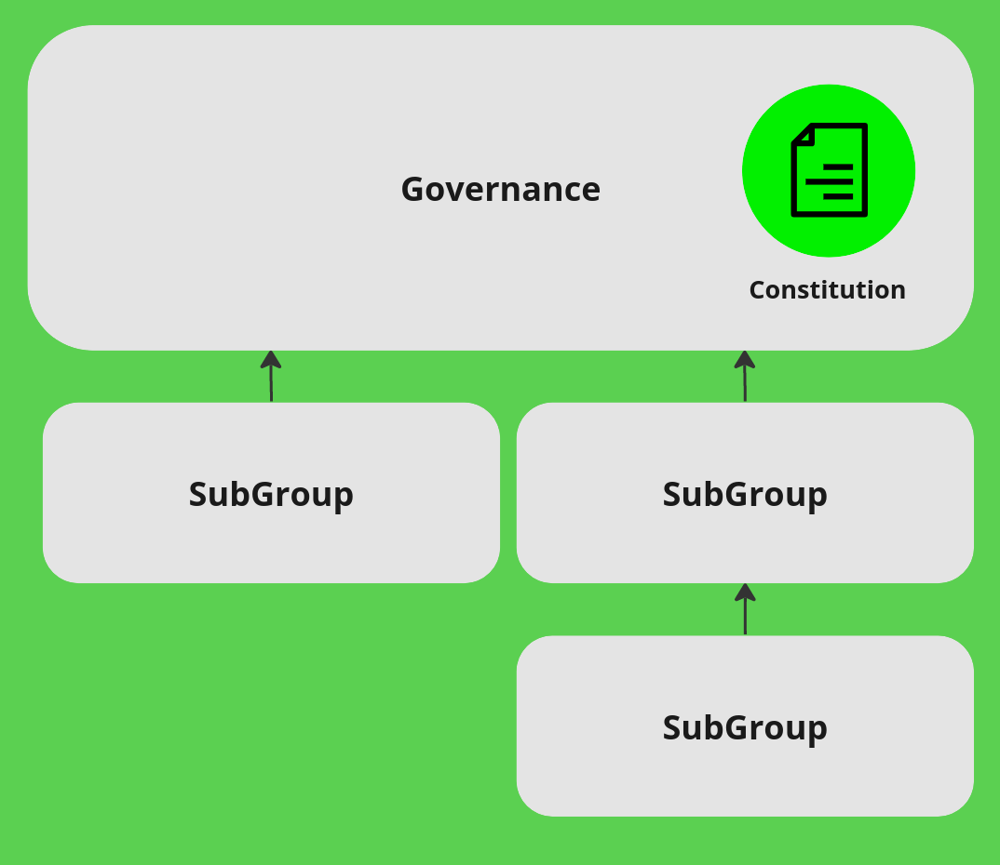

# Governance overview

In Proof-of-Stake blockchains such as EmpowerChain, there is a concept of blockchain-based ecosystem governance.
You can also propose and vote on on-chain governance proposals when you own and stake tokens.
These proposals can be almost anything, from text-based signaling proposals for off-chain discussions to
code changes and parameter adjustments (e.g., distribution rates, rewards, etc.).

The MPWR token is EmpowerChain's network token and, as such, will be used for governance as well.
This is one of the critical ways EmpowerChain will be a public good, owned and controlled by the community and users.

## EmpowerChain governance

EmpowerChain governance is a multi-layered on-chain governance system with a constitution at its core.

The Empowerchain should be a stable and solid public good, reliable and predictable infrastructure.
To ensure this, we aim to have slow, considerate, and purposeful governance. To do this,
we will propose a constitution that will be the core of the governance. The constitution will be a
document that can only be changed by a supermajority of the governance.

As you can see in the image above, the EmpowerChain governance is a multi-layered governance system.
The constitution is the core of the governance, and execution is done by the different entities we call SubGroups.
This way, we can have a slow and considerate governance while still being able to execute fast and efficiently from SubGroups.

To read the current proposal for the constitution, see the [constitution](constitution.md) page.

To see the entities and the layers of governance, see the [governance structure](structure.md) page.

## A note on on-chain governance and our vision from the team
While the initial applications on the EmpowerChain are our main focus,
we also have ideas and a vision for the future regarding on-chain governance.

Governance is key to any Proof of Stake chain. Lately, there have been several examples of
community-splitting governance and we also aim to improve this part of decentralized solutions.

The surprising thing with many existing chains is that they combine the newest technologies and software with
out-of-date codes of law. The earliest known code of law dates back to 2400 BC, and since then,
there have been thousands of years of trying and failing, developing best practices and best solutions
for governance and voting. Even after all this time, it is still not perfect, but combining
the best practices of the code of law with the best-decentralized technologies can bring us a new and
significant step forward. We are part of bringing society and humankind forward.

Today we see many chains applying a code of law that was outdated thousands of years ago.
It is like choosing to store your keys as rock carvings and looking away from thousands of years of
technology development. If we want to move forward, we need to combine the best of technology with the best of governance.
EmpowerChain aims to bring in the best practices we have from democracies, organizations,
and enterprises worldwide and combine that with the decentralized and immutable nature of the blockchain.
Code of law on the blockchain can disrupt the world by enforcing transparency and accountability,
just as it has already proven to be the next generation of currency and financial infrastructure.

EmpowerChain aims to combine these strengths to elevate their utility, bring decentralization,
equal opportunities, trust, and transparency, to make the world better.