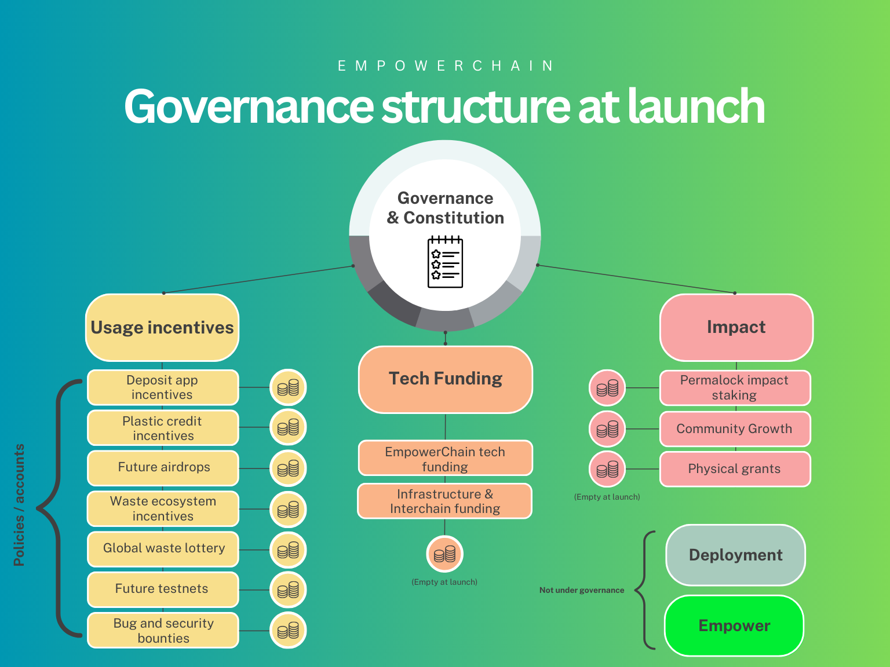

# EmpowerChain governance structure

The EmpowerChain governance is a multi-layered governance system with a constitution at its core.
As seen in the picture below, on-chain governance owns the constitution and the ownership of SubGroups.
The SubGroups are the entities that will hold and execute on funds and proposals coming from governance.

## SubGroups

A SubGroup is an on-chain group consisting of a set of members and decision policies.
Each decision policy is an address that can hold its own funds and have separate rules on voting.

In addition, a SubGroup can have its own SubGroup(s) and be part of another SubGroup.
Initially, we will only use one layer of SubGroups until we see the need for more layers.

For more technical details on how SubGroups work, see the [Group documentation in the Cosmos SDK docs](https://docs.cosmos.network/main/modules/group/).

## Initial structure

At Genesis, EmpowerChain Governance will have the following structure:

- Community governance and a constitution at the core of the governance structure
- Usage incentives SubGroup
  - Deposit app usage incentives policy
  - Plastic credit usage incentives policy
  - Future airdrops policy
  - Waste ecosystem incentives policy
  - Global waste lottery policy
  - Future testnet policy
  - Bugs and security bounties
- Tech funding SubGroup
  - Tech funding policy
  - Infrastructure & Interchain funding policy
- Impact SubGroup
  - Permalock impact staking policy
  - Community growth policy
  - Physical grants policy

Each group and its responsibilities are described in more detail below.

In addition, there will be 2 SubGroups that are not directly under the governance structure:
- Empower Group
  - The team's group for funds and decision-making
- Deployment Group
  - Given deployment rights to CosmWasm contracts on the chain (more can be added or removed by governance) 
  - Administrated by the Empower Group

## Usage incentives SubGroup

The usage incentives SubGroup is responsible for incentivizing usage of the network all the way 
from the dApps to the waste sector - connecting it all together.

It has policies (accounts with funds and rules) for:
- Incentivizing different applications
- Incentivizing the waste sector
- Incentivizing the community through airdrops, testnets and more
- Incentivizing developers to submit bugs and security vulnerabilities

## Tech funding SubGroup

The objective of the tech funding SubGroup is to ensure that the network has long-term sustainability and
stable development of the core infrastructure needed both for developers and users on EmpowerChain. 

In addition, the SubGroup is responsible for funding infrastructure and Interchain public goods development.

## Impact SubGroup
The impact SubGroup is responsible for ensuring that the network grows and has a positive impact on the world.

It has policies for:
- Bootstrapping Plastic Credits and Incentive token markets through the permalocked impact staking policy
- Community growth through incentivizing token liquidity, building strategic partnerships and more
- Physical grants and support for physical network of waste collectors and recyclers

## Transparency
Each group will be responsible for publishing their activities and decisions on a regular basis.
To the extent it is possible, they should do this on-chain and document it there for all to see.

In addition, the groups will be subject to audits and reviews by the community and neutral third parties.