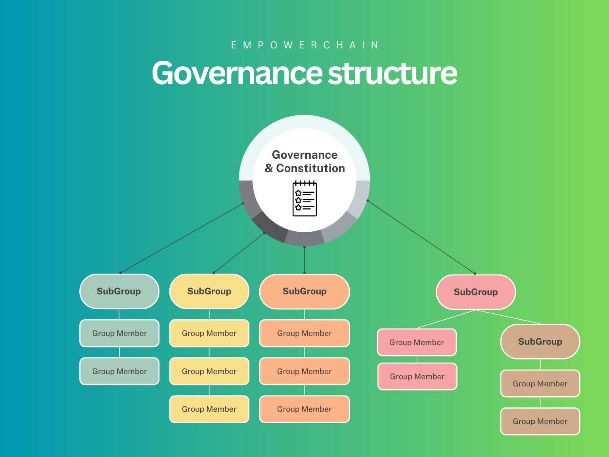

# EmpowerChain governance structure

The EmpowerChain governance is a multi-layered governance system with a constitution at its core.
As can be seen in the picture below, on-chain governance owns the constitution and the ownership of the SubGroups.
The SubGroups are the entities that will hold and execute on funds and proposals coming from governance.

## SubGroups

A SubGroup is an on-chain group that consists of a set of members and a set of decision policies.
Each decision policy is an address that can hold its own funds and have separate rules on how voting is done.

In addition, a SubGroup can have its own SubGroup(s) and can be part of another SubGroup.
Initially we will only have one layer of SubGroups, until we see the needs for more layers.

For more technical details on how SubGroups work, see the [Group documentation in the Cosmos SDK docs](https://docs.cosmos.network/main/modules/group/).

## Initial structure

At genesis, EmpowerChain will have the following structure:

