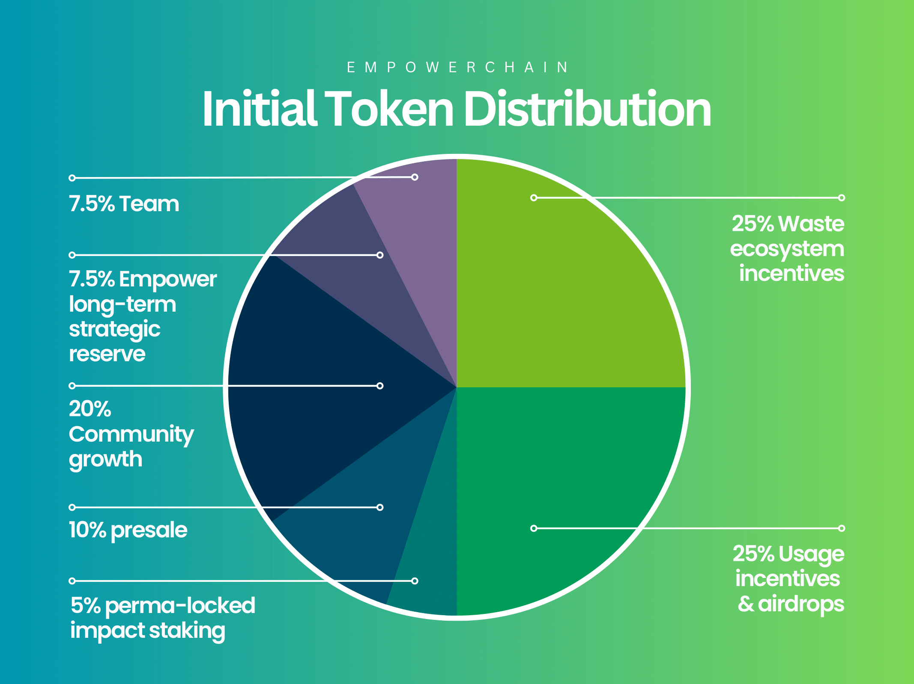

# Tokenomics

This page will go through the two key parts of the EmpowerChain tokenomics: the token distribution and the token economics (how the chain will make money).

## Initial Token Distribution
At launch, the EmpowerChain will have a total supply of 200,000,000 $MPWR tokens, 
with a maximum supply of 1,000,000,000 $MPWR tokens, distributed at a fixed rate as staking rewards over 12 years.

Immediately after launch, the token distribution mechanism (often called inflation, or token minting) will be turned off.
As soon as token holders get a solid chance to stake and get ready, governance can vote to turn on the token distribution mechanism.

The initial token distribution will be as follows:

- 25% for waste collectors and recyclers (to be distributed over time)
- 25% for usage incentives and airdrops (to be distributed over time)
- Up to 10% for private presale (exact numbers TBA - leftovers will go to the growth fund)
- 5% permalocked for an on-chain staking impact
- 20% for community growth, partnerships, liquidity, etc
- 15% for the team (see lockup and vesting details below)

Any funds not owned by the team will be locked in on-chain groups (similar to a multisig) which is owned by the chain itself (through governance),
but will be preset with members of the team, and potentially other community members. The makeup of these groups will be decided by governance of time.
Read more about this under [Governance overview](../governance/overview.md) and [Governance structure](../governance/structure.md).

Each section is explained in more detail below.

### 25% for Waste Collectors and Recyclers
25% will be set aside for waste collectors and recyclers, to be distributed over time.

TODO: WRITE MORE DETAILS ON THIS, W?

### 25% for Usage Incentives and Airdrops
The 50,000,000 $MPWR tokens set aside for usage incentives and airdrops will be split into three parts:
- 22,500,000 $MPWR for deposit app usage incentives (launch happening later this year/early next year)
  - These funds are likely to be vested and distributed over a long time after Deposit App launch
- 6,000,000 $MPWR for plastic credit usage incentives
    - These funds are likely to be vested and distributed over a long period of time
- 10,000,000 for airdrops
    - Some of which will be distributed at genesis, most of which will be distributed over time (TBA)

The current airdrop distribution at launch looks like this:
- Holders of Empower Cyber Plastic Heros NFTs (1000 $MPWR each)
- Holders of Empower Earth Day Plastic Heroes NFTs (20 $MPWR each)
- Delegators on Empower Validator on Stargaze, Regen, IXO, Cheqd and Jackal (Amount TBA)
- Potentially some other groups (TBA)

All unspent tokens at genesis will be held in the Usage incentive group (controlled by members of the team at launch).

### 10% for Private Presale
Up to 10% of the total supply will be sold in a private presale, with the exact amount to be announced closer to mainnet launch.

All tokens are subject to at least 1 year lock-up _plus_ 1 year vesting - with multiple ones having longer lockups (up to 4 years).

The exact details of the private presale (including how long they will be locked and vested) will be announced closer to mainnet launch.

### 5% Permalocked for an On-Chain Staking Impact
5% of the total supply will be permalocked in an on-chain staking impact, which will be used to fund buying of plastic credits and 

## Block rewards

## Sustainable economics (or: how to make money)