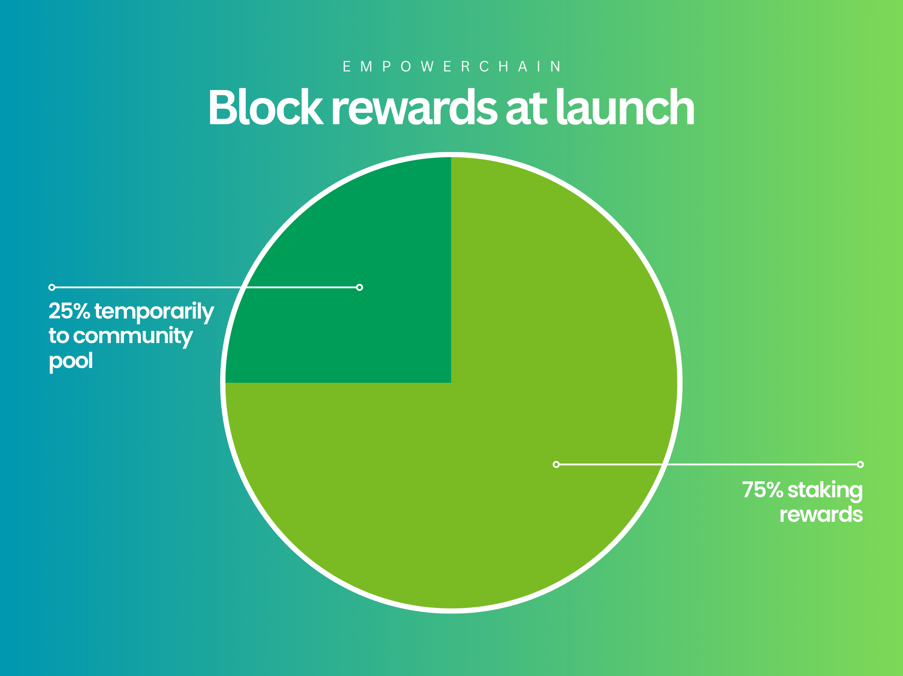
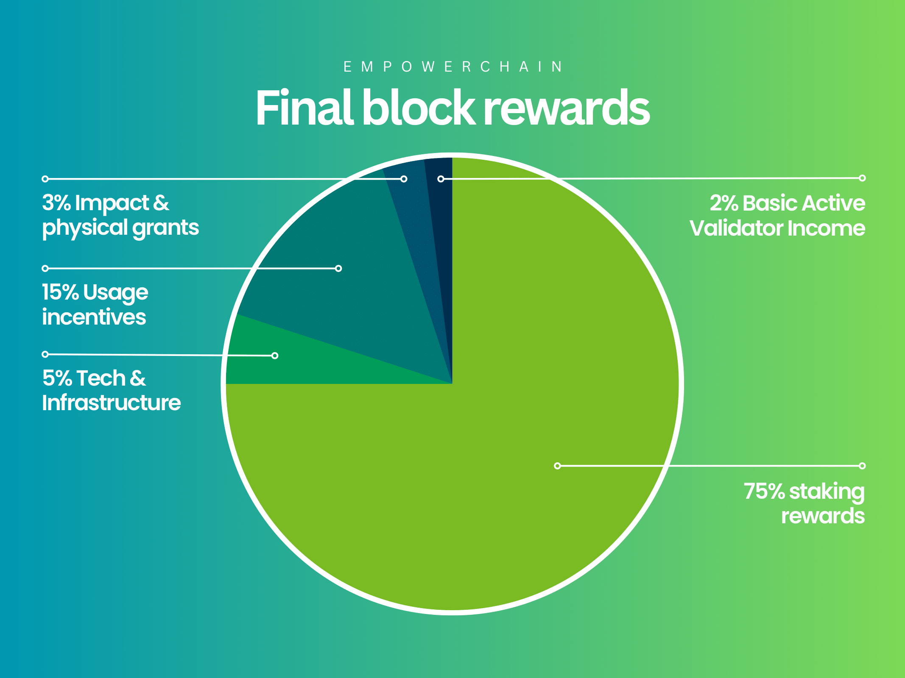

# Emission distribution

The term emission distribution and block rewards are used interchangeably in this document.

At launch, the block rewards are very simply made up of 75% to stakers and 25% to the community pool in the form of the community pool tax.
The 25% of block rewards going to the community pool is not intended to be there for too long and there will be a governance proposal to split
the funds into the same buckets as the planned block rewards.

When we implement the final block rewards, at a later date, they will be as follows:

- 75% to stakers
- 5% to tech & infrastructure
- 15% to usage incentives
- 3% to impact and physical waste infrastructure grants
- 2% as a Basic Active Validator Income (BAVI)

## 75% to stakers
75% of the block rewards will go to stakers, and will be distributed proportionally to the amount of $MPWR staked.
This is standard Cosmos staking, nothing fancy going on here.

## 5% to tech & infrastructure
5% of the block rewards will go to tech & infrastructure, with the objective Ensure the longevity and
continuous stable development of the core infrastructure needed both for dev teams and users on the EmpowerChain as well as for IBC/Cosmos in general.

The tokens will be split into two parts:
- 75% for maintenance and development of the EmpowerChain
- 25% for Interchain public goods funding

The recipients of the tokens will be the Tech funding group which will be without members at launch, but its members will be decided by governance over time.

The usage of these tokens will be subject to annual audits and reports to the community by neutral third parties.
Any spending will also be required to be done and documented on-chain as far as possible.

## 15% to usage incentives

Similar to the 25% from initial genesis distribution, 15% of the block rewards will go to usage incentives for waste
collectors and recycler infrastructure as basis for both the physical and digital network- and infrastructure effects of the Empowerchain.

1% of the total block rewards (take from these 15%) will be set aside for the Global Waste Lottery staking. Details TBA.

The exact details of how this distribution will happen, and under which conditions, will be documented and announced later (before it start, naturally).

## 3% to impact and physical waste infrastructure grants
3% of the block rewards will go to grants and support for physical network of waste collectors and recyclers.
This can be done through various measures as funding to collection and recycling organisations
(direct grants, beneficial loans, subsidised services etc), hackathons, educational content and marketing.

These block rewards can also be put into other initiatives - within the scope of the Impact group - in lack of better investments or to strengthen that part of the ecosystem.

## 2% as a Basic Active Validator Income (BAVI)
2% of the block rewards will be distributed to all active validators as a flat reward, regardless of their delegation amount.
This is to help increase decentralization and security of the network, and to help smaller validators.

The exact mechanism for this will be decided by governance, but the validators participating in this will likely need to be
known to avoid sybil attacks. This might require some sort of identity solution, but it would have to be privacy-preserving.
Governance will decide in the end how this shall be done.

It has not been decided how the BAVI tokens accumulating in the community pool will be distributed/used.
This will be decided by governance in any case.