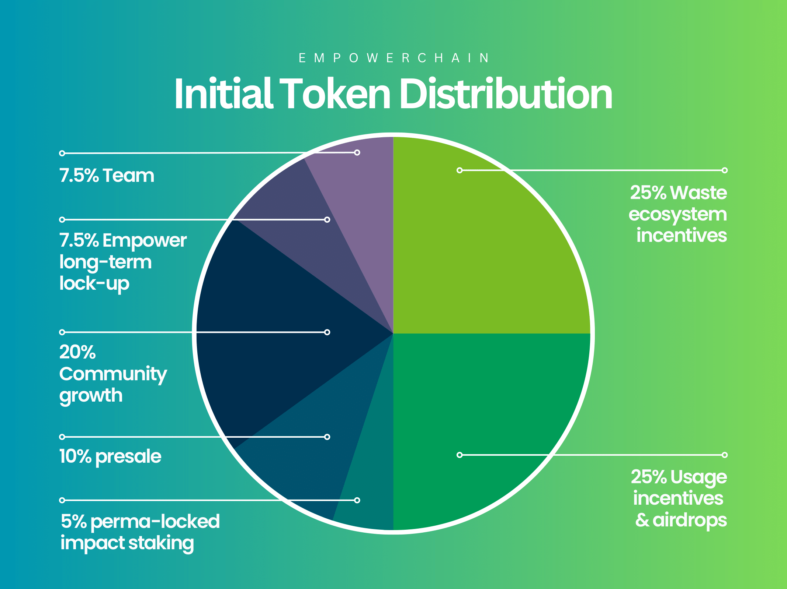

# Initial token distribution

At launch, the EmpowerChain will have a total supply of 200,000,000 $MPWR tokens,
with a maximum supply of 1,000,000,000 $MPWR tokens, distributed at a fixed rate as staking rewards over 12 years.

The initial token distribution will be as follows:

- 25% for waste collectors and recyclers (to be distributed over time)
- 25% for usage incentives and airdrops (to be distributed over time)
- 10% for private presale (exact numbers TBA - remaining funds will be kept for future funding)
- 5% permalocked for an on-chain staking impact
- 20% for community growth, partnerships, liquidity, etc
- 7.5% for team members (see lockup and vesting details below)
- 7.5% for an Empower long-term lockup (see lockup and vesting details below)

Any tokens not owned by the team will be locked in on-chain groups (similar to a multisig) which is owned by the chain itself (through governance),
but will be preset with members of the team, and potentially other community members. The makeup of these groups will be decided by governance of time.
Read more about this under [Governance overview](../governance/overview.md) and [Governance structure](../governance/structure.md).

Any locked or vested tokens are still possible to stake and accrue staking rewards. The staking rewards are
liquid tokens that are transferable. This is how the Cosmos SDK vesting accounts work, so the design of the
tokenomics is trying to take this into account. This means that for instance Empower's long-term lockup tokens will
be able to accrue staking rewards (even though the initial amount is fully locked for 5 years).
There will be some exceptions to this, for instance the team tokens will not be paid out any staking rewards
the first year. The exact mechanism we will use for this is still being discussed and will be announced later.

Each section is explained in more detail below.

> A short note on usage incentives: most of the usage incentives in both the
> initial distribution and the block rewards are not fully documented here _yet_.
> It is important to note that these usage incentives are subject to audits and transparency requirements,
> as they are owned by the chain itself. Documentation and details will be added and announced as they are finalized. 
> In any case, they will be distributed over time and be subject to vesting and lockup periods.

## 25% for Waste Collectors and Recyclers
25% will be set aside for waste collectors and recyclers, to be distributed over time.
The main goal is to incentivise and include global network of waste collection and recycling infrastructure as
basis for both the physical and digital network- and infrastructure effects of the Empowerchain.

The exact details of how this distribution will happen, and under which conditions, will be documented and announced later (before it start, naturally).

These usage incentives tokens are held by the Usage Incentives group (controlled by members of the team at launch).

## 25% for Usage Incentives and Airdrops
The 50,000,000 $MPWR tokens set aside for usage incentives and airdrops will be split into three parts:
- 22,500,000 $MPWR for deposit app usage incentives (launch happening later this year/early next year)
    - These tokens are likely to be vested and distributed over a long time after Deposit App launch
- 6,000,000 $MPWR for plastic credit usage incentives
    - These tokens are likely to be vested and distributed over a long period of time
- 10,000,000 for airdrops
    - Some of which will be distributed at genesis, the rest will be distributed over time (TBA)

All unspent tokens at genesis will be held by the Usage incentive group (controlled by members of the team at launch).

## 10% for Private Presale
Up to 10% of the total supply will be sold in private presale(s).

All tokens are subject to at least 1 year lock-up _plus_ 1 year vesting - with multiple ones having longer lockups (up to 4 years).

Any tokens not sold in the private presale will be kept for future funding (but will still be subject to vesting and lockup periods).

## 5% Permalocked for an On-Chain Staking Impact
5% of the total supply will be permalocked on-chain and used for impact staking, the rewards from which will be used to buying of plastic credits and deposit incentives in the market.

The permalocked tokens (and its rewards) will be controlled by the Impact group (controlled by members of the team at launch).

## 20% for Community Growth, Partnerships, Liquidity, etc
Incentivise token liquidity on DEX/CEXes and to build strategic partnerships across Cosmos and IBC through token swaps or other incentives and alignments

Within these 20% there are also sub-initiatives for:
- Testnet rewards (a total of 1% of the total supply, 0.5% of which for the first testnet and the rest for future testnets)
- Bug and security bounty program (1% of the total supply)

These two initatives are held by the Usage incentives group. The other 18% are held by the Impact group.

## 7.5% for Team Members
7.5% of the total supply will be allocated to team members, with a minimum of 1 year lockup and 5 year vesting.

To ensure members of the team are not being incentivized after they stop working on the project, we have placed all
the tokens in the Empower group. From there they tokens will be distributed to team members as they vest.
This also allows us to move any incentives over to new team members in the scenario of exchange of personnel.
A smart contract to handle this will be developed and deployed after launch.

Our biggest priority is to ensure the long-term success of the EmpowerChain, and we believe this will help us achieve that.
Especially, we don't end up in a situation where team members are paid too much up-front, and then leave the project and keep dumping tokens for years - as we have seen in many other projects.

## 7.5% for an Empower Long-Term Lock-up
7.5% of the total supply will be allocated to Empower for long-term lock-up, with a 5-year lockup + 5 year vesting period.
Meaning that these tokens will only be fully vested after 10 years.

The goal of these tokens is long-term alignment for Empower to keep building and supporting the chain and its ecosystem.
