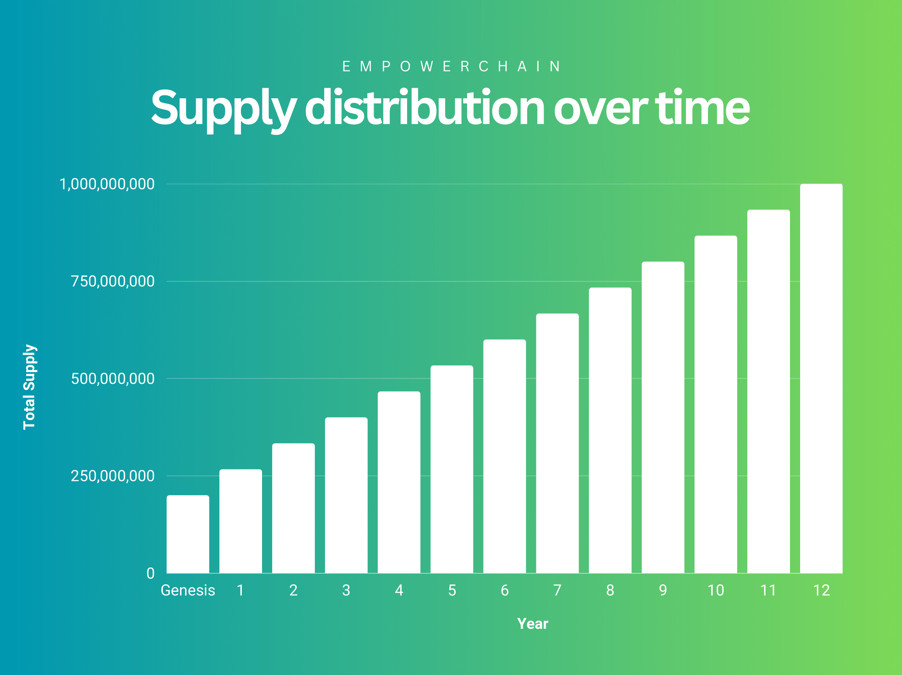
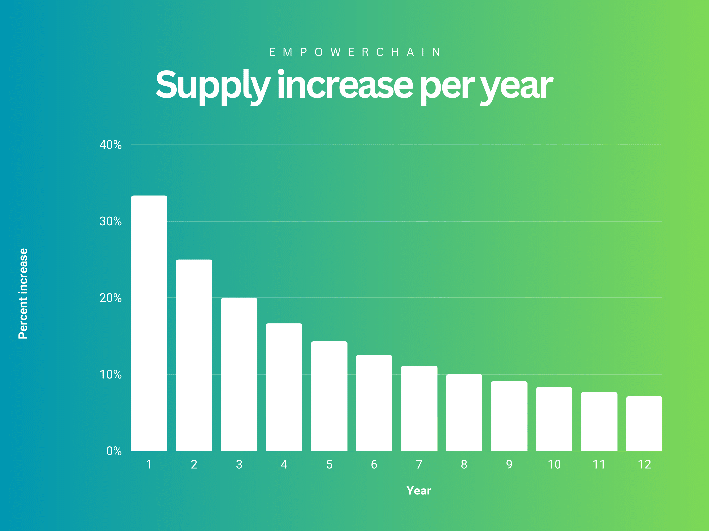

# Tokenomics Overview

The EmpowerChain tokenomics are designed to make the native network utility token, $MPWR, a useful and valuable asset 
for all participants in the EmpowerChain ecosystem. This is important for long-term development and maintenance, but
more importantly to ensure that the token is a viable incentive for actors in the waste sector to participate.

## Token overview

EmpowerChain uses a native network utility token called $MPWR (pronounced "empower").

The $MPWR token is used for:
- Network security (validation and staking)
- Governance
- Paying for transaction fees
- Paying for services and usage fees on different applications

Supply at genesis is 200,000,000 $MPWR tokens, with a maximum supply of 1,000,000,000 $MPWR tokens to be reached over 12 years.

## Initial distribution

The initial distribution of $MPWR tokens is designed to ensure that the network has long-term sustainability and 
firepower to incentivize users and actors in both the web3 and waste sector world.

To read more details about the initial distribution, see [Initial token distribution](./initial-token-distribution.md).

## Emission schedule

The emission schedule is simply: linear emission over 12 years, starting at 200,000,000 $MPWR tokens and ending at 1,000,000,000 $MPWR tokens.
Which means that the number of token emitted per year is 66,666,666.

The emission curve, or supply increase percentage, looks like this:

## Emission distribution (or: block rewards)

At launch the block rewards will simply be 75% to stakers and 25% to the community pool - with the community pool being
a placeholder for the tokens to be distributed (if governance decides to do so) to the different purposes outlaid in the
final block reward plan:

Once we have implemented the final block rewards they will focus on the following areas:
- Incentivizing stakers
- Incentivizing usage of the network
- Incentivizing development of the network
- Support physical infrastructure development in the waste sector

Together, they are designed to ensure that the network has long-term sustainability and incentives for all stakeholders in the network.

To read more details about the final block rewards, see [Block rewards](./block-rewards.md).

## Sustainable economics
The big question for any blockchain is how it will operate sustainably in the long term. The EmpowerChain network token
is a utility token, and is needed to use the network. It is needed not only for gas fees, but also for:
- Usage fees for dApps
- Plastic Credit issuance fees
- Marketplace fees
- And other fees from using the network in different way
- Staking
- Participating/voting in governance

The utility of the MPWR token, and the demand for it, will be driven by the usage of the network.
WIth the network owning and using the tokens for various purposes, there will be a constant demand for the token.