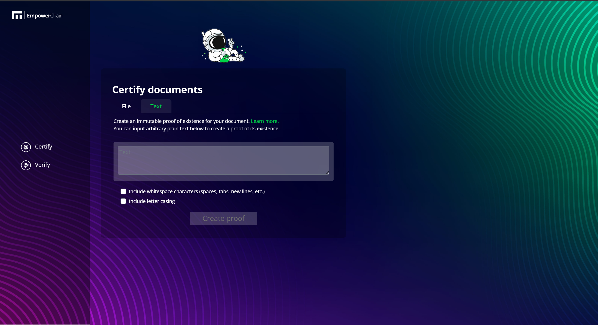

# Introduction

Proof of Existence on EmpowerChain is a feature designed to allow users to prove the existence of any document or piece of data at a specific point in time. This high-level overview will provide you with a brief explanation of the purpose, concepts, and implementation of the Proof of Existence module on EmpowerChain.

The main use case at first for proof of existence is for tracking data to be time-stamped and immutable.

for more full explanation you can read on [proof of existence](../core-modules/proof-of-existence/high-level-overview.md) section.

## Pre requisite

- Empower Wallet (empower1xwXXXXXXXXXXXXX)
- Any type document that you wish to certify as proof of existence. or you can use plain text to certify as proof of existence
- Some MPWR Token

## Certify

Visit [https://testnet.proof-of-existence.com/](https://testnet.proof-of-existence.com/)

> ### File
>
> 1. Choose **_Certify_** Menu, choose **_File_** tab and click **_Browse_**
>
> 
>
> 2. Select your files that you want to create the PoE
>
> 
>
> 3. Click **_Create proof_**
>
> 
>
> 4. Connect your wallet, you can use **_Keplr_**, **_cosmostation_**, or **_leap_**
>
> 
>
> 5. Completed transaction on you wallet
>
> 
>
> 6. You will see proof of existence certificate, You can copy the verification link and send it to someone that needed the proof of existence of your document
>
> 

> ### Text
>
> 1. Choose **_Certify_** Menu, choose **_Text_** tab
>
> 
>
> 2. There is 2 options available on checklist, It will produce different hash based on your options. We will cover it later.
>
> 
>
> 3. Just like file PoE, you need to connect your wallet and completed the transaction
>
> 
>
> 4. You will see proof of existence certificate, You can copy the verification link and send it to someone that needed the proof of existence of your document
>
> 
>
> 5. In step 2, we mention that it will produce different hash based on your options, as you can see in screenshot, we don't check the options
>
> 
>
> 6. It's produce different hash, with options it create hash "4666853d2d63581e14ba6bc32f49b5c945ae3cfac38f2d8fce1a7e1f0f45dcfd", without options it create hash "ff826b8389624dce9009b0a8b34eb5d55c477c1ba4cc5fceec1d311b086d0128", It means that the hash will different if we supply different text or file
>
> 

## Verify

Visit [https://testnet.proof-of-existence.com/verify](https://testnet.proof-of-existence.com/verify)

> ### File
>
> 1. If you want to check that the document on EmpowerChain, you can use this to verify the file PoE, Choose **_File_** tab, Click **_browse_** and select your files
> 
>
> 2. And if the document was right, it should show the hash stored on EmpowerChain. even you change the document name, it can verify your document
>
>

> ### Text
>
> 1. If you want check some words or text on EmpowerChain, you can use this to verify the text PoE, Choose **_Text_** tab, type your words
> > **Note:** Make sure you use the right style of your words, like letter casing words and whitespace characters, because it will produce different hash
>
> 
>
> 2. And if the words was right, it should show the hash stored on EmpowerChain. 
>
>